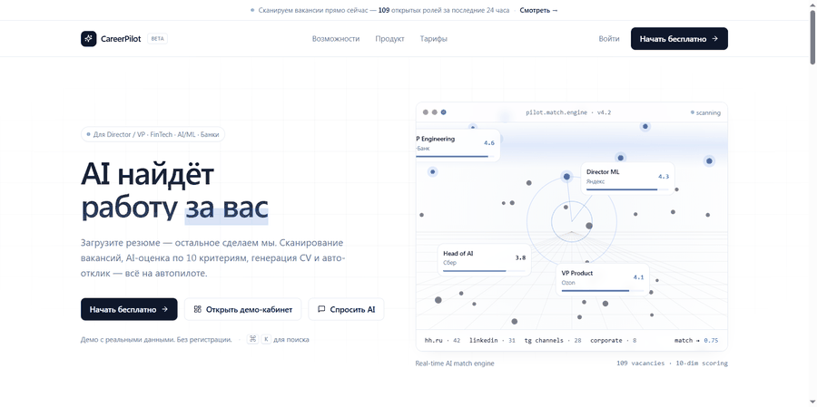
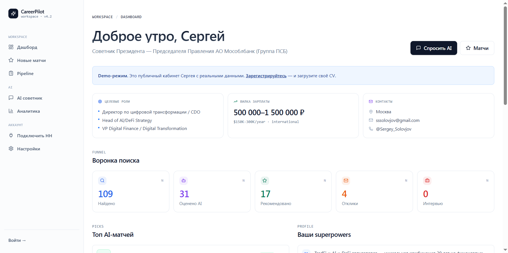
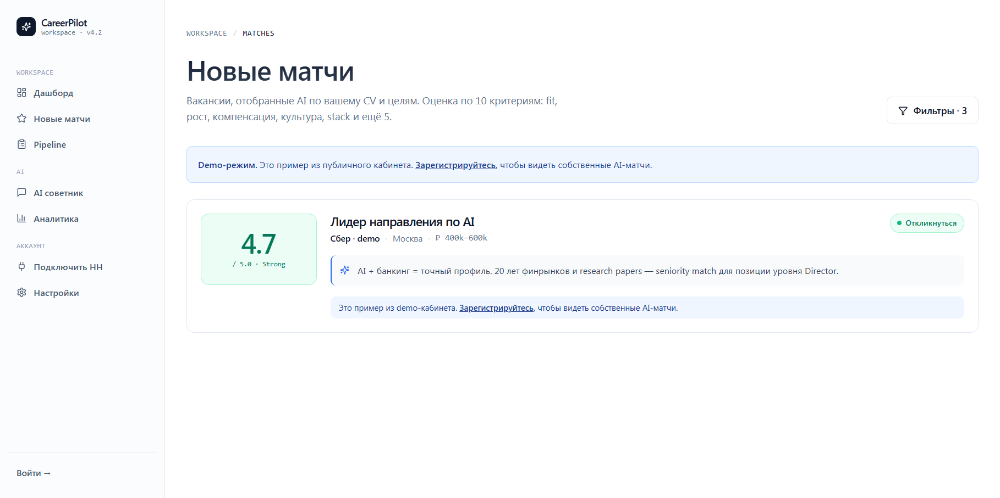
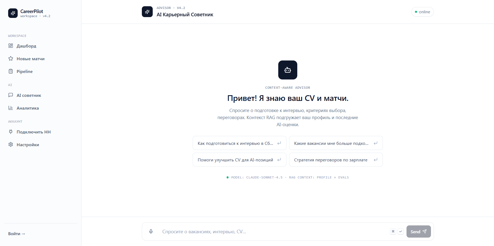
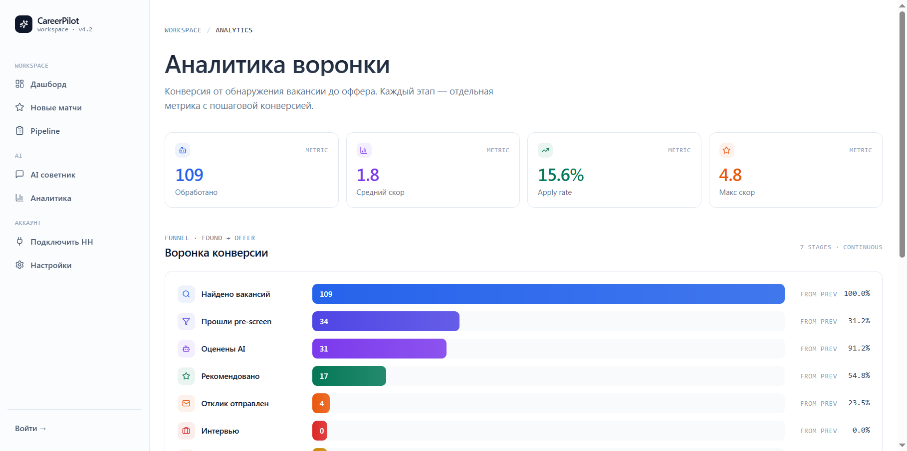
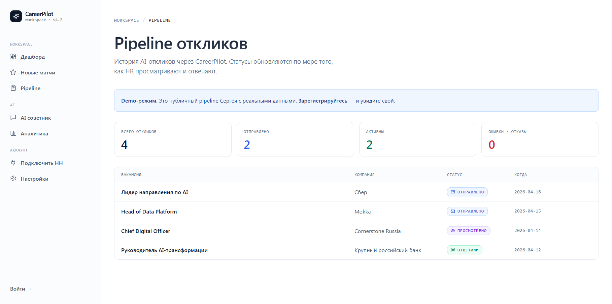
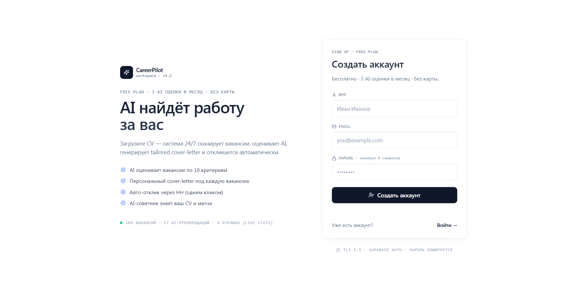

<div align="center">

# 🚀 CareerPilot

**AI-агент для автоматического поиска работы на уровне Директор / CDO / Head of AI**

[](https://careerpilot-umber.vercel.app/dashboard)
[](https://nextjs.org)
[](https://anthropic.com)
[](https://supabase.com)
[](https://vercel.com)
[](https://typescriptlang.org)

Загрузите CV → система 24/7 сканирует вакансии, оценивает AI по 10 критериям,
генерирует tailored cover-letter и откликается через HH автоматически.

🌐 **[Открыть demo (без регистрации)](https://careerpilot-umber.vercel.app/dashboard)**

</div>

---

## ✨ Что умеет

| Модуль | Описание |
|--------|----------|
| 🔍 **Scan** | Сканирует hh.ru каждые 4 часа по ключевым словам из профиля |
| 🤖 **Score** | AI оценивает каждую вакансию по 10 критериям (fit, рост, компенсация, культура, stack…) |
| ✍️ **Tailor** | Генерирует персональный cover-letter со ссылкой на ваш CV |
| 📧 **Auto-apply** | Отправляет отклики через залогиненную сессию HH |
| 📊 **Track** | Pipeline с real-time статусами (sent → viewed → replied) |
| 💬 **RAG advisor** | AI-советник с контекстом вашего профиля + последних матчей |
| 🎤 **Voice** | Голосовой ввод вопросов в чате (ru-RU) |
| 📱 **Telegram** | Бот для уведомлений о новых матчах |

---

## 🎬 Демо



### Живые ссылки

| Страница | Что увидите |
|---|---|
| [`/`](https://careerpilot-umber.vercel.app/) | Лендинг с canvas-анимацией match engine |
| [`/dashboard`](https://careerpilot-umber.vercel.app/dashboard) | Demo-кабинет автора — реальные метрики 109/31/17/4 |
| [`/matches`](https://careerpilot-umber.vercel.app/matches) | AI-оценённые вакансии с 10-dim radar |
| [`/chat`](https://careerpilot-umber.vercel.app/chat) | RAG-советник |
| [`/analytics`](https://careerpilot-umber.vercel.app/analytics) | 7-stage funnel с конверсиями |
| [`/signup`](https://careerpilot-umber.vercel.app/signup) | Регистрация (3 AI-оценки бесплатно) |

---

## 🎯 Критерии МагоЛего — 12 / 12

| # | Критерий | Статус | Где смотреть |
|---|---|---|---|
| 1 | Прикладная задача | ✅ | End-to-end поиск работы для Директоров |
| 2 | Vibe-coding | ✅ | 29 commits с `Co-Authored-By: Claude` |
| 3 | LLM внутри | ✅ | `claude-sonnet-4-5-20250929` в 4 endpoints |
| 4 | Telegram-бот | ✅ | [`apps/web/app/api/telegram/`](apps/web/app/api/telegram/) |
| 5 | Лендинг | ✅ | [`apps/web/app/page.tsx`](apps/web/app/page.tsx) |
| 6 | Веб UI | ✅ | 11 страниц в `apps/web/app/(app)/` и `(auth)/` |
| 7 | Авторизация | ✅ | Supabase Auth + middleware |
| 8 | RAG-ассистент | ✅ | [`/chat`](https://careerpilot-umber.vercel.app/chat) — retrieves profile + evals |
| 9 | База данных | ✅ | Supabase PostgreSQL, 5 таблиц с RLS |
| 10 | Voice input | ✅ | Web Speech API в `/chat`, `lang='ru-RU'` |
| 11 | Дашборд | ✅ | `/dashboard` с funnel metrics |
| 12 | Воронка | ✅ | `/analytics` — 7 stages, per-stage conversion |

---

## 🧱 Tech stack

### Frontend
- **Next.js 16** (App Router) — SSR + Server Components
- **React 19** — UI layer
- **Tailwind CSS v4** — `@theme` directive + custom properties
- **lucide-react** — иконки (нет emoji)
- **globals.css utility classes** — `.card`, `.btn-primary`, `.pill`, `.grad-text`, `.pulse-dot`

### Backend
- **Next.js Server Actions** — auth actions (`signIn`, `signUp`)
- **Next.js API Routes** — 15 endpoints (`/api/chat`, `/api/scan-now`, `/api/apply`, …)
- **Supabase** — PostgreSQL + Auth
- **Browserless** (DigitalOcean) — AI-логин в HH через headless Chrome

### AI
- **`@anthropic-ai/sdk`** — прямые вызовы
- **Vercel AI SDK** (`ai` + `@ai-sdk/anthropic`) — streaming chat
- **Модель:** `claude-sonnet-4-5-20250929` (configurable через `ANTHROPIC_MODEL`)

### Infra
- **Vercel** — production `careerpilot-umber.vercel.app`
- **Turborepo** — monorepo с `@careerpilot/web` + `@careerpilot/core`
- **pnpm** — package manager

---

## 🏗 Архитектура

```
career-ops/
├── apps/
│   └── web/                       # Next.js frontend + API
│       ├── app/
│       │   ├── (app)/             # Auth-required страницы
│       │   │   ├── dashboard/     # Funnel + top matches + superpowers
│       │   │   ├── matches/       # AI-оценки + apply button
│       │   │   ├── chat/          # RAG + voice
│       │   │   ├── pipeline/      # Отклики со статусами
│       │   │   ├── analytics/     # 7-stage funnel
│       │   │   ├── onboarding/    # 3-step setup
│       │   │   ├── connect-hh/    # HH login flow
│       │   │   ├── settings/      # CV + keywords editor
│       │   │   └── layout.tsx     # Sidebar (lucide icons)
│       │   ├── (auth)/            # Public auth
│       │   │   ├── login/
│       │   │   └── signup/
│       │   ├── api/               # 15 endpoints
│       │   │   ├── chat/          # RAG streaming
│       │   │   ├── profile/       # CRUD профиля
│       │   │   ├── scan-now/      # Сканер + AI-оценка
│       │   │   ├── apply/         # Auto-apply с cover-letter
│       │   │   ├── hh/            # HH integration
│       │   │   └── telegram/      # Bot endpoints
│       │   ├── page.tsx           # Лендинг
│       │   └── globals.css        # Design tokens
│       ├── lib/
│       │   ├── supabase/          # DB + Auth client
│       │   ├── browserless.ts     # HH login automation
│       │   └── encryption.ts      # Cookie encryption
│       └── supabase/migrations/   # DB schema
├── packages/
│   └── core/                      # Shared types + utilities
├── infra/                         # Deployment configs
├── jobs/                          # Cron jobs
└── n8n/                           # Workflow automation templates
```

---

## 🚀 Запуск локально

```bash
# 1. Clone + install
git clone https://github.com/SergeySolovyev/career-ops.git
cd career-ops
pnpm install

# 2. Environment
cp .env.example apps/web/.env.local
# Заполнить: SUPABASE_URL, SUPABASE_ANON_KEY, ANTHROPIC_API_KEY,
# ENCRYPTION_KEY, BROWSERLESS_URL, TELEGRAM_BOT_TOKEN

# 3. DB migrations
pnpm --filter @careerpilot/web exec supabase db push

# 4. Dev server
pnpm --filter @careerpilot/web dev

# → http://localhost:3000
```

### Деплой

Push в ветку `main` или `careerpilot` → Vercel подхватывает автоматически.
Детали в [`DEPLOY.md`](DEPLOY.md).

---

## 📸 UI Gallery

| Dashboard | Matches | Chat |
|---|---|---|
|  |  |  |

| Analytics | Pipeline | Settings |
|---|---|---|
|  |  |  |

---

## 📚 Документация

- [`DEPLOY.md`](DEPLOY.md) — как задеплоить
- [`Отчёт_по_проекту_CareerPilot.xlsx`](Отчёт_по_проекту_CareerPilot.xlsx) — трекинг разработки

---

## 👥 Contributors

- **Сергей Соловьёв** — owner / vision / QA
- **Claude (Anthropic)** — 100% code authoring через Claude Code SDK

---

<div align="center">

**Made with [Claude Code](https://claude.com/claude-code) · Deployed on [Vercel](https://vercel.com)**

*CareerPilot — итоговый проект курса МагоЛего (апрель 2026)*

</div>
